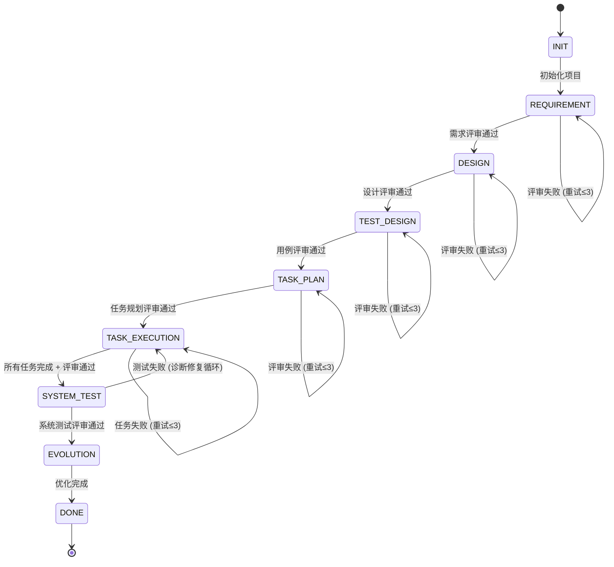
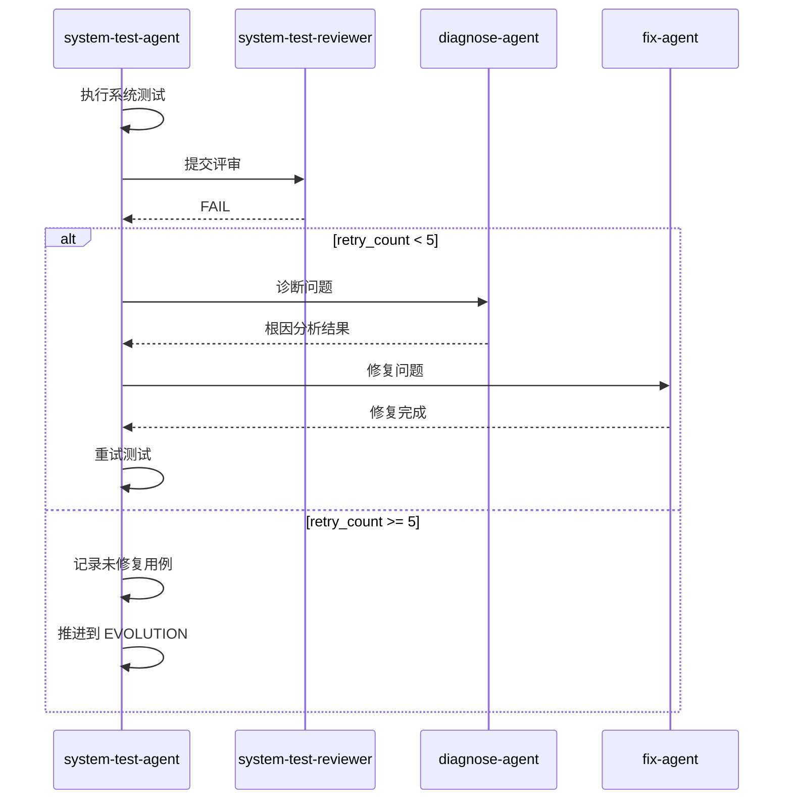

# 软件设计说明书（SDD）

## State Engine Plugin

**版本**: 1.0.1
**日期**: 2026-05-03
**作者**: koree

---

## 1. 概述

### 1.1 项目背景

State Engine Plugin 是一个基于 Harness Engineering 思想的 Claude Code 插件，旨在实现端到端自迭代软件开发。该系统通过状态机管理软件开发全生命周期，采用 PDCA（Plan-Do-Check-Optimize）循环和 TDD（测试驱动开发）原则，实现软件开发过程的自动化与可追溯。

### 1.2 设计目标

1. **状态可视化**: 清晰展示软件开发流程的各个阶段及当前进度
2. **流程自动化**: 自动化执行开发流程中的各个步骤
3. **质量保证**: 通过双阶段 Review（执行+评审）确保产出质量
4. **可恢复性**: 支持开发过程中断后的快速恢复
5. **经验积累**: 通过经验沉淀机制传递知识，避免重复犯错

### 1.3 适用范围

- 复杂软件需求的端到端开发
- 需要规范开发流程的团队协作
- 需要可追溯、可验证软件开发过程的项目

---

## 2. 系统架构

### 2.1 整体架构图

```
┌─────────────────────────────────────────────────────────────────────┐
│                        Claude Code 主会话                           │
│                         (调度层/编排层)                              │
└─────────────────────────────────────────────────────────────────────┘
                                   │
            ┌──────────────────────┼──────────────────────┐
            ▼                      ▼                      ▼
    ┌───────────────┐      ┌───────────────┐      ┌───────────────┐
    │    Skills     │      │    Agents     │      │    Hooks      │
    │   (阶段逻辑)   │      │  (任务执行)   │      │  (生命周期)   │
    └───────────────┘      └───────────────┘      └───────────────┘
            │                      │                      │
            └──────────────────────┼──────────────────────┘
                                   ▼
    ┌───────────────────────────────────────────────────────────────────┐
    │                         Scripts (工具层)                           │
    │  ┌─────────────────┐  ┌─────────────────┐  ┌─────────────────┐   │
    │  │ checkpoint.sh   │  │ state-machine.sh│  │  (扩展脚本)     │   │
    │  └─────────────────┘  └─────────────────┘  └─────────────────┘   │
    └───────────────────────────────────────────────────────────────────┘
                                   │
                                   ▼
    ┌───────────────────────────────────────────────────────────────────┐
    │                    checkpoint.json (状态持久化)                     │
    │  { state, current_task, pending_tasks, completed_tasks, ... }     │
    └───────────────────────────────────────────────────────────────────┘
```

### 2.2 组件说明

| 组件类型 | 组件名称 | 职责 | 关键文件 |
|---------|---------|------|---------|
| **Skills** | requirement-collect | 需求收集与整理 | `skills/requirement-collect/SKILL.md` |
| | design | 系统架构设计 | `skills/design/SKILL.md` |
| | testcase | 测试用例设计 | `skills/testcase/SKILL.md` |
| | task-planning | 任务规划与拆分 | `skills/task-planning/SKILL.md` |
| | state | 状态查询、推进、回滚 | `skills/state/SKILL.md` |
| | git | Git 操作封装 | `skills/git/SKILL.md` |
| | evolution | 经验沉淀与规则生成 | `skills/evolution/SKILL.md` |
| **Agents** | task-execution-agent | 任务执行（PDCA+TDD） | `agents/task-execution-agent.md` |
| | diagnose-agent | 问题诊断与根因定位 | `agents/diagnose-agent.md` |
| | fix-agent | 问题修复 | `agents/fix-agent.md` |
| | code-reviewer | 代码质量评审 | `agents/code-review.md` |
| | requirement-reviewer | 需求评审 | `agents/requirement-review.md` |
| | design-reviewer | 设计评审 | `agents/design-review.md` |
| | testcase-reviewer | 用例评审 | `agents/testcase-reviewer.md` |
| | task-planning-reviewer | 任务规划评审 | `agents/task-planning-reviewer.md` |
| | system-test-agent | 系统测试执行 | `agents/system-test-agent.md` |
| | system-test-reviewer | 系统测试评审 | `agents/system-test-reviewer.md` |
| **Hooks** | session-start | 会话启动时恢复状态 | `hooks/session-start` |
| | stop-hook | 会话停止时保存状态 | `hooks/stop-hook` |
| **Scripts** | checkpoint.sh | 状态持久化 | `scripts/checkpoint.sh` |
| | state-machine.sh | 状态转换管理 | `scripts/state-machine.sh` |

---

## 3. 状态机设计

### 3.1 状态定义

```
INIT → REQUIREMENT → DESIGN → TEST_DESIGN → TASK_PLAN → TASK_EXECUTION → SYSTEM_TEST → EVOLUTION → DONE
```

| 状态索引 | 状态名称 | 中文名 | 说明 |
|---------|---------|--------|------|
| 0 | INIT | 初始化 | 项目开始，状态机起始点 |
| 1 | REQUIREMENT | 需求分析 | 需求收集和评审阶段 |
| 2 | DESIGN | 架构设计 | 系统架构设计阶段 |
| 3 | TEST_DESIGN | 用例设计 | 测试用例设计阶段 |
| 4 | TASK_PLAN | 任务规划 | 任务拆分与规划阶段 |
| 5 | TASK_EXECUTION | 任务执行 | 代码实现阶段 |
| 6 | SYSTEM_TEST | 系统测试 | 集成测试阶段 |
| 7 | EVOLUTION | 进化优化 | 错误分析和优化阶段 |
| 8 | DONE | 完成 | 项目结束 |

### 3.2 状态转换规则

```
┌─────────────────────────────────────────────────────────────────────┐
│                          状态转换规则                                 │
├─────────────────────────────────────────────────────────────────────┤
│  1. Review 门禁: 推进状态前必须通过评审 (current_review_passed=true)  │
│  2. 顺序执行: 只能推进到下一个状态，不能跳过                           │
│  3. 可回滚: 可以回滚到任意之前的状态                                  │
│  4. 可恢复: 所有状态变更都更新 checkpoint.json                         │
└─────────────────────────────────────────────────────────────────────┘
```

### 3.3 状态转换流程图



### 3.4 重试与回滚策略

| 失败类型 | 最大重试次数 | 超出处理 |
|---------|-------------|---------|
| Review 失败 | 3 次 | 回滚到上一阶段 |
| 系统测试失败 | 5 次 | 记录未修复用例，推进到 EVOLUTION |
| 任务执行失败 | 3 次 | 移到 failed_tasks，继续下一任务 |

---

## 4. 目录结构设计

### 4.1 需求目录结构

每个需求对应一个独立的目录，采用日期+需求名的命名规范：

```
${REQUIREMENT_DIR}/                    # 需求根目录
├── requirements/                       # 需求规格文档
│   ├── SRS.md                         # 软件需求规格说明书
│   └── SRS-review-result.md           # 需求评审结果
├── design/                            # 架构设计文档
│   ├── design.md                      # 架构设计文档
│   └── design-review-result.md        # 设计评审结果
├── testcase/                          # 测试用例
│   ├── testcase-list.md               # 用例列表
│   ├── TC-001.md                      # 用例详情（可选）
│   ├── TC-002.md
│   └── testcase-review-result.md      # 用例评审结果
├── tasks/                             # 任务规划
│   ├── tasks-list.md                  # 任务列表
│   └── tasks-review-result.md         # 任务规划评审结果
├── specs/                             # 任务规格
│   ├── T001-spec.md                   # 任务 T001 规格
│   ├── T002-spec.md
│   └── ...
├── execution/                         # 任务执行
│   ├── T001/                          # 任务 T001 执行产物
│   │   ├── plan.md                    # 计划
│   │   ├── test.md                    # 测试用例
│   │   ├── code.md                    # 代码变更
│   │   ├── verify.md                  # 验证结果
│   │   ├── check.md                   # 检查结果
│   │   ├── optimize.md                # 优化结果
│   │   ├── spec-review.md             # 规格评审
│   │   └── code-review.md             # 代码评审
│   ├── T002/
│   └── ...
├── systemtest/                        # 系统测试
│   ├── test-report.md                 # 测试报告
│   ├── bug.md                         # Bug 记录
│   ├── diagnosis_result.json          # 诊断结果
│   └── fix_result.json                # 修复结果
├── .memory/                           # 经验沉淀
│   └── PROJECT.md                     # 项目经验文档
├── .rule/                             # 规则沉淀
│   └── RULE.md                        # 开发规则文档
└── recovery/                          # 状态恢复
    └── checkpoint.json                # 检查点文件
```

### 4.2 检查点文件格式

```json
{
  "state": "TASK_EXECUTION",
  "current_task": "T003",
  "completed_tasks": ["T001", "T002"],
  "pending_tasks": ["T004", "T005"],
  "failed_tasks": [],
  "retry_count": 0,
  "current_review_passed": true,
  "state_review_status": {
    "REQUIREMENT": "PASS",
    "DESIGN": "PASS",
    "TEST_DESIGN": "PASS",
    "TASK_PLAN": "PASS"
  },
  "systemtest_retry_count": 0,
  "failed_test_cases": [],
  "requirement_name": "需求名",
  "updated_at": "2026-04-10T00:00:00Z"
}
```

---

## 5. 核心工作流程

### 5.1 PDCA + TDD 循环

每个任务的执行遵循 PDCA 循环结合 TDD 原则：

```
┌─────────────────────────────────────────────────────────────────────┐
│                          PDCA + TDD 循环                             │
├─────────────────────────────────────────────────────────────────────┤
│                                                                      │
│  ┌─────────┐     ┌──────────────────────────────────────────────┐   │
│  │  Plan   │────▶│               Do (TDD)                        │   │
│  │  计划   │     │  ┌─────────┐  ┌─────────┐  ┌─────────┐       │   │
│  └─────────┘     │  │  Test   │→ │  Code   │→ │ Verify  │       │   │
│       │          │  │  写测试  │  │  写代码  │  │  验证   │       │   │
│       │          │  └─────────┘  └─────────┘  └─────────┘       │   │
│       │          └──────────────────────────────────────────────┘   │
│       ▼                              │                              │
│  ┌─────────┐                         │                              │
│  │  Check  │◀────────────────────────┘                              │
│  │  检查   │                         │                              │
│  └─────────┘                         ▼                              │
│       │                    ┌─────────────┐                          │
│       │                    │  Optimize   │                          │
│       │                    │    优化     │                          │
│       │                    └─────────────┘                          │
│       │                              │                              │
│       └──────────────────────────────┘                              │
│                    (若 Check FAIL，返回 Plan)                        │
│                                                                      │
└─────────────────────────────────────────────────────────────────────┘
```

### 5.2 各阶段执行流程

#### 5.2.1 需求分析阶段 (REQUIREMENT)

```
┌─────────────────────────────────────────────────────────────────────┐
│                         REQUIREMENT 阶段                             │
├─────────────────────────────────────────────────────────────────────┤
│                                                                      │
│  1. requirement-collect Skill 执行需求收集                           │
│     ├── 场景挖掘 (9大类场景)                                         │
│     ├── 存量项目分析                                                 │
│     ├── EARS 需求编写                                                │
│     └── 输出 requirements/SRS.md                                     │
│                                                                      │
│  2. 评审                                                               │
│     └── requirement-reviewer Agent 评审                              │
│                                                                      │
│  3. 决策                                                               │
│     ├── PASS: 推进到 DESIGN，调用 evolution 沉淀经验                  │
│     └── FAIL: 重试（最多3次）或回滚                                   │
│                                                                      │
└─────────────────────────────────────────────────────────────────────┘
```

#### 5.2.2 架构设计阶段 (DESIGN)

```
┌─────────────────────────────────────────────────────────────────────┐
│                          DESIGN 阶段                                 │
├─────────────────────────────────────────────────────────────────────┤
│                                                                      │
│  1. design Skill 执行架构设计                                        │
│     ├── 需求理解与澄清                                               │
│     ├── 技术上下文探索                                               │
│     ├── 逻辑视图设计                                                 │
│     ├── 功能模块划分                                                 │
│     ├── 数据模型设计                                                 │
│     ├── API 接口设计                                                 │
│     ├── 流程设计（伪代码）                                           │
│     ├── 关键细节设计                                                 │
│     └── 输出 design/design.md                                        │
│                                                                      │
│  2. 评审                                                               │
│     └── design-reviewer Agent 评审                                   │
│                                                                      │
│  3. 决策                                                               │
│     ├── PASS: 推进到 TEST_DESIGN，调用 evolution 沉淀经验             │
│     └── FAIL: 重试（最多3次）或回滚                                   │
│                                                                      │
└─────────────────────────────────────────────────────────────────────┘
```

#### 5.2.3 任务执行阶段 (TASK_EXECUTION)

```
┌─────────────────────────────────────────────────────────────────────┐
│                       TASK_EXECUTION 阶段                            │
├─────────────────────────────────────────────────────────────────────┤
│                                                                      │
│  主循环:                                                              │
│  ┌─────────────────────────────────────────────────────────────────┐│
│  │ WHILE pending_tasks 非空 DO                                      ││
│  │                                                                  ││
│  │   1. 取出下一个任务 → current_task                               ││
│  │   2. task-execution-agent 执行任务 (PDCA + TDD)                  ││
│  │      ├── Plan: 生成 plan.md                                     ││
│  │      ├── Test: 编写测试，输出 test.md                            ││
│  │      ├── Code: 实现代码，输出 code.md                            ││
│  │      ├── Verify: 运行测试，输出 verify.md                         ││
│  │      ├── Check: 验收标准核对，输出 check.md                       ││
│  │      └── Optimize: 优化代码，输出 optimize.md                     ││
│  │   3. spec-reviewer 评审规格                                      ││
│  │   4. code-reviewer 评审代码                                      ││
│  │   5. IF spec-review==PASS AND code-review==PASS                  ││
│  │        THEN: 调用 evolution → 标记任务完成 → 继续下一任务         ││
│  │      ELSE: 标记任务失败 → 移回 pending_tasks → 重试              ││
│  │                                                                  ││
│  │ END WHILE                                                         ││
│  └─────────────────────────────────────────────────────────────────┘│
│                                                                      │
│  所有任务完成后推进到 SYSTEM_TEST                                     │
│                                                                      │
└─────────────────────────────────────────────────────────────────────┘
```

#### 5.2.4 系统测试阶段 (SYSTEM_TEST)

```
┌─────────────────────────────────────────────────────────────────────┐
│                        SYSTEM_TEST 阶段                              │
├─────────────────────────────────────────────────────────────────────┤
│                                                                      │
│  1. system-test-agent 执行系统测试                                   │
│     └── 输出 systemtest/test-report.md                               │
│                                                                      │
│  2. system-test-reviewer 评审测试结果                                │
│                                                                      │
│  3. 决策                                                               │
│     ├── PASS: 推进到 EVOLUTION                                       │
│     ├── FAIL 且 retry_count >= 5:                                    │
│     │   └── 记录未修复用例 → 推进到 EVOLUTION                        │
│     └── FAIL 且 retry_count < 5:                                     │
│         ├── diagnose-agent 诊断问题                                  │
│         ├── fix-agent 修复问题                                       │
│         └── 重试                                                     │
│                                                                      │
└─────────────────────────────────────────────────────────────────────┘
```

### 5.3 诊断修复循环

当系统测试失败时，触发诊断修复循环：



---

## 6. 数据模型

### 6.1 状态机关联数组 (state-machine.sh)

```bash
declare -A STATE_NAMES
STATE_NAMES["INIT"]="初始化"
STATE_NAMES["REQUIREMENT"]="需求分析"
STATE_NAMES["DESIGN"]="架构设计"
STATE_NAMES["TEST_DESIGN"]="用例设计"
STATE_NAMES["TASK_PLAN"]="任务规划"
STATE_NAMES["TASK_EXECUTION"]="任务执行"
STATE_NAMES["SYSTEM_TEST"]="系统测试"
STATE_NAMES["EVOLUTION"]="进化优化"
STATE_NAMES["DONE"]="完成"

STATE_ORDER=("INIT" "REQUIREMENT" "DESIGN" "TEST_DESIGN" "TASK_PLAN" "TASK_EXECUTION" "SYSTEM_TEST" "EVOLUTION" "DONE")
```

### 6.2 状态转换映射

| 当前状态 | 允许的下一状态 | 允许的回退状态 |
|---------|--------------|--------------|
| INIT | REQUIREMENT | - |
| REQUIREMENT | DESIGN | INIT |
| DESIGN | TEST_DESIGN | REQUIREMENT |
| TEST_DESIGN | TASK_PLAN | DESIGN |
| TASK_PLAN | TASK_EXECUTION | TEST_DESIGN |
| TASK_EXECUTION | SYSTEM_TEST | TASK_PLAN |
| SYSTEM_TEST | EVOLUTION | TASK_EXECUTION |
| EVOLUTION | DONE | SYSTEM_TEST |
| DONE | - | - |

---

## 7. 接口设计

### 7.1 Checkpoint 接口 (checkpoint.sh)

| 函数名 | 参数 | 返回值 | 说明 |
|-------|------|-------|------|
| `checkpoint::init` | `[project_dir]` | void | 初始化 checkpoint |
| `checkpoint::read` | `[project_dir]` | JSON | 读取 checkpoint 内容 |
| `checkpoint::get_state` | `[project_dir]` | string | 获取当前状态 |
| `checkpoint::update_state` | `<state> [project_dir]` | void | 更新状态 |
| `checkpoint::update_task` | `<task_id> [project_dir]` | void | 更新当前任务 |
| `checkpoint::mark_task_complete` | `<task_id> [project_dir]` | void | 标记任务完成 |
| `checkpoint::get_pending_tasks` | `[project_dir]` | JSON array | 获取未完成任务 |
| `checkpoint::init_task_list` | `[project_dir]` | void | 从 tasks-list.md 初始化任务 |
| `checkpoint::start_task` | `<task_id> [project_dir]` | void | 开始任务 |
| `checkpoint::mark_task_failed` | `<task_id> [project_dir]` | void | 标记任务失败 |
| `checkpoint::set_review_passed` | `<true/false> [project_dir]` | void | 设置 review 状态 |
| `checkpoint::is_review_passed` | `[project_dir]` | boolean | 检查 review 是否通过 |
| `checkpoint::advance_state_with_review` | `<state> [project_dir]` | void | 推进状态并重置 review |
| `checkpoint::print_info` | `[project_dir]` | void | 打印 checkpoint 信息 |

### 7.2 状态机接口 (state-machine.sh)

| 函数名 | 参数 | 返回值 | 说明 |
|-------|------|-------|------|
| `state_machine::is_valid_state` | `<state>` | boolean | 检查状态是否有效 |
| `state_machine::get_next_state` | `<state>` | string | 获取下一状态 |
| `state_machine::get_prev_state` | `<state>` | string | 获取上一状态 |
| `state_machine::can_transition` | `<from> <to>` | boolean | 检查是否可以转换 |
| `state_machine::get_state_name` | `<state>` | string | 获取状态中文名 |
| `state_machine::get_all_states` | - | list | 获取所有状态 |
| `state_machine::get_progress` | `<state>` | int | 获取进度百分比 |
| `state_machine::print_info` | `<state>` | void | 打印状态机信息 |

---

## 8. 安全与约束

### 8.1 会话管理约束

| 约束类型 | 说明 |
|---------|------|
| **退出条件** | 状态为 DONE、重试次数达最大且无法修复、严重错误 |
| **禁止退出** | 任务未完成、Review 失败需修复、有未提交变更、重试次数未达最大 |
| **禁止行为** | 主对话直接编写代码、直接修改执行文件、直接运行测试、主动询问用户是否继续 |

### 8.2 文件完整性约束

推进状态前必须验证产出文件存在且有效：

| 状态 | 必需的产出文件 |
|-----|--------------|
| REQUIREMENT | requirements/SRS.md |
| DESIGN | design/design.md |
| TEST_DESIGN | testcase/testcase-list.md |
| TASK_PLAN | tasks/tasks-list.md |
| TASK_EXECUTION | execution/T*/code.md, execution/T*/verify.md (所有任务) |
| SYSTEM_TEST | systemtest/test-report.md |

### 8.3 上下文压缩约束

在 REQUIREMENT、DESIGN、TEST_DESIGN、TASK_PLAN 阶段执行完成且 Review 通过后，必须使用 `/compact` 命令压缩上下文，减少后续阶段的上下文长度。

---

## 9. 扩展性设计

### 9.1 Skill 扩展

新增 Skill 只需在 `skills/<name>/SKILL.md` 创建文件，并在 `using-e2e` Skill 的组件配置表中注册。

### 9.2 Agent 扩展

新增 Agent 只需在 `agents/<name>.md` 创建文件，并在相应的触发条件中注册。

### 9.3 脚本扩展

新增工具函数可在 `scripts/` 目录下创建脚本文件，通过 `source` 命令加载。

---

## 10. 依赖关系

### 10.1 外部依赖

| 依赖 | 版本 | 用途 |
|-----|------|------|
| Bash | >= 4.0 | 脚本执行环境 |
| jq | 可选 | JSON 解析（提供则使用，否则使用 fallback） |
| Git | - | 版本控制 |

### 10.2 内部依赖

| 组件 | 依赖组件 | 说明 |
|-----|---------|------|
| using-e2e | state, git, evolution | 状态管理、Git操作、经验沉淀 |
| task-execution-agent | checkpoint.sh | 任务状态管理 |
| diagnose-agent | bug.md | 问题信息读取 |

---

## 11. 版本历史

| 版本 | 日期 | 修改内容 |
|-----|------|---------|
| 1.0.1 | 2026-05-03 | 初始版本 |